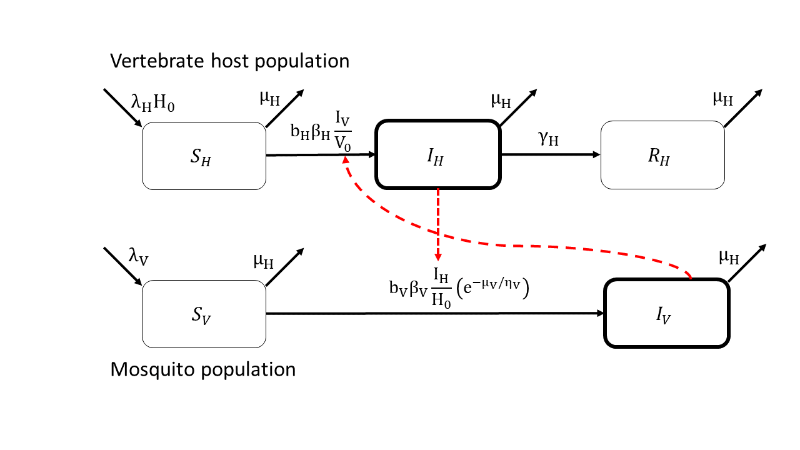

```{r setup, include=FALSE}
knitr::opts_chunk$set(echo = FALSE, cache = FALSE, warning = FALSE, fig.pos = "H", out.extra = "",
                      dev = c("pdf"))
# Load Libraries------------------------------------------------------------------------------
library(tidyverse)
library(latex2exp)
library(numDeriv)
library(reshape2)
library(deSolve)
library(cowplot)
library(viridis)
library(metR)
library(MetBrewer) # for colorblind friendly color palettes
library(colorspace)
library(ggpmisc)
library(here)
library(foreach)
library(doParallel)
library(directlabels)
library(pBrackets)
library(ggdark)
library(cols4all)

# Helper function: place legends in empty facets of plot grids
# Code by: Artem Sokolov, found here: https://stackoverflow.com/questions/54438495/shift-legend-into-empty-facets-of-a-faceted-plot-in-ggplot2
shift_legend <- function(p) {
  pnls <- cowplot::plot_to_gtable(p) %>%
    gtable::gtable_filter("panel") %>%
    with(setNames(grobs, layout$name)) %>%
    purrr::keep(~ identical(.x, zeroGrob()))
  
  if (length(pnls) == 0) stop("No empty facets in the plot")
  
  lemon::reposition_legend(p, "center", panel = names(pnls))
}

# Load in data and parameters ----

# Functions for computing equilibrium quantities: 
#  mosquito abundance (compute.V0), basic reproduction number (compute.R0), 
#  equilibrium infected vector prevalence (compute.pV), and
#  equilibrium infected vector abundance (compute.IV)
source("code/output-functions.R")

# Specify which host dataset to use (loading in both will use up too much memory)
family = "rodent"

VectorTraits_df <- read_rds("results/VectorTraits.rds")
AllOutputs_df <- rbind(read_rds("results/AllOutputs_low.rds"),
                       read_rds("results/AllOutputs_high.rds"),
                       read_rds("results/AllOutputs_none.rds")) %>% 
  ungroup() %>% 
  filter(Family == family)
```

```{r Fig_1_Flow_Diagram, out.width='100%', fig.align='center'}

```

```{r Fig_S3_Mosquito_TPCs,  out.width='100%', fig.height=9, fig.width=12, fig.align='center'}
# Extract mosquito species, temperature, and parameters from the full table

# Read in vector trait data
VecParms <- VectorTraits_df %>% 
  mutate(P_EIP = exp(-muV / etaV)) %>%
  select(sample_num, Temperature, system_ID, sigmaV, sigmaV_f, rhoL, lf, deltaL, P_EIP, betaV) %>% 
  pivot_longer(cols = sigmaV:betaV) %>% 
  group_by(Temperature, system_ID, name) %>% 
  summarise(
    median = median(value),
    .groups = "keep") %>% 
  pivot_wider(names_from = name, values_from = median)

## Set up plot dataframe
MosqThermTraits_df <- VecParms %>%
  # Mortality rate
  mutate(muV = 1 / lf) %>%
  # Select relevant traits and parameters
  select(Temperature, system_ID, sigmaV, sigmaV_f, rhoL, lf, deltaL, P_EIP, betaV) %>%
  # Turn all columns except Temperature and system_ID into variables
  melt(id = c("Temperature", "system_ID")) %>%
  mutate(variable = factor(variable,
                           levels = c("lf", "sigmaV", "sigmaV_f", "rhoL", "deltaL", "P_EIP", "betaV"),
                           labels = c(
                             TeX("(a) Adult lifespan: $1/\\mu_V$ (days)"),
                             TeX("(b) Biting frequency: $\\sigma_V$ (day$^{-1}$)"),
                             TeX("(c) Eggs per female per day: $\\sigma_V f$"),
                             TeX("(d) Immature development rate: $\\rho_L$ (day$^{-1}$)"),
                             TeX("(e) Prob. of immature survival: $\\delta_L$"),
                             TeX("(f) Prob. of surviving EIP: $\\theta_V$"),
                             TeX("(g) Vector competence: $\\beta_V$")
                           )
  )) %>%
  group_by(Temperature, system_ID)

MosqThermTraits_plot <- MosqThermTraits_df %>%
  # Set up plotting variables and theme
  # x = Temperature, y = trait value
  ggplot(mapping = aes(x = Temperature, y = value, group = system_ID)) +
  # Plot trait values:
  geom_line(aes(colour = system_ID), size = 1) +
  # x-axis:
  scale_x_continuous(
    name = "Temperature (°C)",
    expand = c(0, 0),
    limits = c(10, 40),
    breaks = seq(10, 40, 2)
  ) +
  # y-axis:
  scale_y_continuous(expand = c(0.05, 0)) +
  # color:
  scale_color_manual(
    name = "System:",
    values = met.brewer("Egypt", 5, direction = -1),
    labels = function(x) {
      case_when(
        x == "Aedes aegypti / DENV" ~ "*Aedes aegypti* and DENV",
        x == "Aedes aegypti / ZIKV" ~ "*Ae. aegypti* and ZIKV",
        x == "Aedes albopictus / DENV" ~ "*Aedes albopictus* and DENV",
        x == "Anopheles gambiae / Plasmodium falciparum" ~ "*Anopheles gambiae* and *Plasmodium falciparum*",
        x == "Culex quinquefasciatus / WNV" ~ "*Culex quinquefasciatus* and WNV"
      )
    }
  ) +
  # faceting:
  facet_wrap(~variable,
             nrow = 3, scales = "free",
             labeller = labeller(variable = label_parsed)
  ) +
  # legend:
  guides(color = guide_legend(override.aes = list(size = 4))) +
  # theme options:
  theme_minimal_vgrid(10) +
  theme(
    axis.title.y = element_blank(),
    legend.position = "bottom",
    legend.margin = margin(),
    legend.text = ggtext::element_markdown(),
    legend.direction = "vertical",
    legend.justification = "center",
    axis.title.x = element_text(hjust = 0),
    strip.text = element_text(
      face = "bold",
      hjust = 0
    )
  )

shift_legend(MosqThermTraits_plot)
```

```{r Fig_2_Trait_Fits, message=FALSE, out.width='100%', fig.width=6.5, fig.height=3.65625, fig.align='center'}

FitsTable <- read.csv("data/clean/fits-table.csv")

R2_df <- FitsTable %>%
  select(Measure, var, R2, Family) %>%
  mutate(R2 = sprintf("R^2 ==%.2f", R2)) %>%
  distinct()

primate_plot = FitsTable%>% 
  filter(Measure == "5") %>% 
  filter(Family == "primate") %>% 
  ggplot(mapping = aes(x = pace, y = value)) +
  # plot empirical values as points
  geom_point(alpha = 0.5,
             color = c4a(palette = "seaborn.bright", n = 2)[1],
             size = 0.5) +
  # plot fitted curve in blue
  geom_line(aes(x = pace, y = (curve)), lwd = 1, color = "black") +
  # label R^2 value
  geom_text(data = filter(R2_df, Family == "primate", Measure == "5"), aes(label = R2),
            x = 1, y = -Inf, hjust = 1, vjust = -.25, parse = TRUE,
            size = 8/.pt
  ) +
  xlab("Pace of life") +
  facet_wrap(Family ~ var, 
             scales = "free_y", 
             strip.position = "left",
             labeller = labeller(var = c(
               K = "Population density",
               lambda = "Recruitment rate",
               mu = "Mortality rate"
             ),
             Family = c(rodent = "", primate = ""))) +
  scale_y_continuous(trans = "log10") +
  ylab(NULL) +
  theme_half_open(8) +
  ggtitle("A") +
  theme(
    strip.text = element_text(face="plain"),
    axis.text.x = element_text(face="plain", vjust = 0.65),
    axis.text.y = element_text(face="plain"),
    strip.background = element_blank(),
    strip.placement = "outside"
  )

rodent_plot = FitsTable %>% 
  filter(Measure == "5") %>% 
  filter(Family == "rodent") %>% 
  ggplot(mapping = aes(x = pace, y = value)) +
  # plot empirical values as points
  geom_point(alpha = 0.5,
             color = c4a(palette = "seaborn.bright", n = 2)[2],
             size = 0.5) +
  # plot fitted curve in blue
  geom_line(aes(x = pace, y = (curve)), lwd = 1, color = "black") +
  # label R^2 value
  geom_text(data = filter(R2_df, Family == "rodent", Measure == "5"), aes(label = R2),
            x = 1, y = -Inf, hjust = 1, vjust = -.25, parse = TRUE,
            size = 8/.pt
  ) +
  xlab("Pace of life") +
  facet_wrap(Family ~ var, 
             scales = "free_y", 
             strip.position = "left",
             labeller = labeller(var = c(
               K = "Population density",
               lambda = "Recruitment rate",
               mu = "Mortality rate"
             ),
             Family = c(rodent = "", primate = ""))) +
  scale_y_continuous(trans = "log10") +
  ylab(NULL) +
  theme_half_open(8) +
  ggtitle("B") +
  theme(
    strip.text = element_text(face="plain"),
    axis.text.x = element_text(face="plain", vjust = 0.65),
    axis.text.y = element_text(face="plain"),
    strip.background = element_blank(),
    strip.placement = "outside"
  )

plot_grid(primate_plot, rodent_plot, nrow = 2)

```

```{r Fig_S1_Primate_Trait_Fits, message=FALSE, out.width='100%', fig.width=6.5, fig.height=3.65625, fig.align='center'}

FitsTable <- read.csv("data/clean/fits-table.csv")

MeasureFit_df = FitsTable %>% 
  select(Measure, var, R2, Family) %>% 
  distinct() %>% 
  group_by(Measure, Family) %>% 
  summarize(Fit_score = norm(R2,type = "2"))

measure_labeller <- function(measure) {
  c(
    "5" = "A. PCA1 loading",
    "4" = "B. Total sum of\nnormalized life\nhistory traits",
    "3" = "C. Maximum lifetime\n reproductive output\nper unit mass",
    "2" = "D. Maximum lifetime\nreproductive output",
    "1" = "E. Generation time"
  )
}

FitsTable$Measure <- factor(FitsTable$Measure, levels = c("5", "4", "3", "2", "1"))

fitplot <- FitsTable %>%
  filter(Family == "primate") %>%
  mutate(R2 = sprintf("R^2 ==%.2f", R2)) %>%
  ggplot(aes(x = pace, y = value)) +
  # plot empirical values as points
  geom_point(alpha = 0.5,
             color = c4a(palette = "seaborn.bright", n = 2)[1], 
             size = 0.5) +
  # plot fitted curve in black
  geom_line(aes(x = pace, y = (curve)), lwd = 1, color = "black") +
  # label R^2 value
  geom_text(data = filter(R2_df, Family == "primate"), aes(label = R2),
            x = 1, y = -Inf, 
            hjust = 1,
            vjust = -.25, 
            parse = TRUE,
            size = 8/.pt
  ) +    
  facet_grid(cols = vars(Measure), rows = vars(var),
             scales = "free",
             switch = "y",
             labeller = labeller(
               var = as_labeller(c(
                 K = "Population density",
                 lambda = "Recruitment rate",
                 mu = "Mortality rate")),
               Measure = measure_labeller)
  ) +
  scale_x_continuous(name = "Pace of life", labels = NULL) +
  scale_y_continuous(trans = "log10") +
  ylab(NULL) +
  theme_half_open(8) +
  theme(
    strip.text = element_text(face="plain", hjust = 0),
    axis.text.x = element_text(face="plain", vjust = 0.65),
    axis.text.y = element_text(face="plain"),
    strip.background = element_blank(),
    strip.placement = "outside"
  )

fitplot
```

```{r Fig_S2_Rodent_Trait_Fits, message=FALSE, out.width='100%', fig.width=6.5, fig.height=3.65625, fig.align='center'}

fitplot <- FitsTable %>%
  filter(Family == "rodent") %>%
  mutate(R2 = sprintf("R^2 ==%.2f", R2)) %>%
  ggplot(aes(x = pace, y = value)) +
  # plot empirical values as points
  geom_point(alpha = 0.5,
             color = c4a(palette = "seaborn.bright", n = 2)[2],
             size = 0.5) +
  # plot fitted curve in black
  geom_line(aes(x = pace, y = (curve), group = Measure), lwd = 1, color = "black") +
  # label R^2 value
  geom_text(data = filter(R2_df, Family == "rodent"), aes(label = R2),
            x = 1, y = -Inf,
            hjust = 1,
            vjust = -.25,
            parse = TRUE,
            size = 8/.pt
  ) +
  facet_grid(
    cols = vars(Measure),
    rows = vars(var),
    scales = "free",
    switch = "y",
    labeller = labeller(
      var = as_labeller(c(
        K = "Population density",
        lambda = "Recruitment rate",
        mu = "Mortality rate")),
      Measure = measure_labeller
      )
  ) +
  scale_x_continuous(name = "Pace of life", labels = NULL) +
  scale_y_continuous(trans = "log10") +
  ylab(NULL) +
  theme_half_open(8) +
  theme(
    strip.text = element_text(face="plain", hjust = 0, vjust = 0.5),
    axis.text.x = element_text(face="plain", vjust = 0.65),
    axis.text.y = element_text(face="plain"),
    strip.background = element_blank(),
    strip.placement = "outside"
  )

fitplot
```

```{r Fig_S4_lambdaR0_B, message=FALSE, out.width='100%', fig.width=10, fig.height=6, fig.align='top'}
# Put together a figure that helps the reader interpret the relationship between lambda_R0 and B
# Function to evaluate equation (2) in the main text

# set values for k.p and r.p
# cases:
# 1. 0 < |k.p| < r.p : dR0/dp > 0
# 2. 0 >-|k.p| > r.p : dR0/dp < 0
# 3. |k.p| > |r.p|   : sign of dR0/dp dependent on B

k.p <- c(-1.5, 1.5, 1.5, -1.5)
r.p <- c(   1,   1,  -2,    2)


# set values for blood meal supply-demand ratio
B <- seq(0, 10, length.out = 101)

# Function: value of the left-hand side of the inequality in the above Lemma
inequality_LHS <- function(input) {
  with(input, {
    bite_tradeoff <- (B - 1) / (B + 1)
    # K.c and mu.c come from trait-hyperparameters.R script, beta.c and alpha.c come from pathogen description
    return(0.5 * (bite_tradeoff * k.p + r.p))
  })
}

# plot takes fixed values for k.p and r.p, then plots the LHS of the inequality as a function of B = blood meal supply-demand ratio
# these could be curves or a heat map
# curves can better show variety of situations
inequality_df <- expand_grid(tibble(k.p = k.p, r.p = r.p), B) %>%
  mutate(LHS = inequality_LHS(.)) %>% 
  mutate(label = sprintf("c[K] ==%1$.2f~and~r ==%2$.2f", k.p,r.p))

# Plot figure
inequality_plot <- inequality_df %>%
  ggplot(mapping = aes(x = B, y = LHS, group = interaction(k.p, r.p))) +
  geom_line(alpha = 0) +
  geom_line(size = 1) +
  geom_hline(yintercept = 0) +
  # Labels for curves
  geom_text(data = filter(inequality_df, B == 5), 
            aes(x = 5, y = LHS, label = label),
            color = "black",
            nudge_y = 0.1, parse = TRUE) +
  theme_half_open(12) +
  xlab(TeX("Blood meal demand-supply ratio, $B$")) +
  ylab(TeX("$\\lambda_{R_0}$, the logarithmic derivative of $R_0(p)$, ")) +
  scale_x_continuous(expand = c(0, 0)) +
  scale_y_continuous(expand = c(0, 0)) +
  ylim(-1.25, 1.25) +
  theme(
    axis.text = element_text(size = 20),
    strip.text.x = element_text(size = 20),
    strip.text.y = element_text(size = 20),
    axis.title = element_text(size = 20, face = "bold"),
    legend.title = element_text(size = 20),
    legend.text = element_text(size = 18),
    plot.title = element_text(size = 20),
    axis.line.x = element_blank(),
    legend.key.height = unit(1, "cm")
  )

inequality_plot
```

```{r Table_2_Critical_VH_Ratios}

# # Uncomment this to get values from Table 2 (won't work when knitting)
# 
# family_in = family
# 
# source("code/trait-functions.R")
# 
# # Extract maximum biting frequencies for each mosquito
# max_sigmaV <- VectorTraits_df %>%
#   group_by(system_ID) %>%
#   summarise(max_sigmaV = max(sigmaV))
# 
# 
# critB_table <- expand_grid(Pathogen_type = c("Acute", "Chronic"),
#                            Pathogen_transmissibility = c("Low", "High"),
#                            Immune_variation = c("Low", "High"),
#                            system_ID = unique(VectorTraits_df$system_ID),
#                            sigmaH = c(10, 100, Inf)) %>%
#   left_join(max_sigmaV) %>%
#   ungroup() %>%
#   mutate(alpha.c = get.Host.alpha.c(.)) %>%
#   mutate(beta.c = get.Host.beta.c(.)) %>%
#   mutate(r = -mu.c + alpha.c + beta.c) %>%
#   mutate(K.c = K.c) %>%
#   mutate(xi = -r / K.c) %>%
#   mutate(crit_val = sigmaH * (1 + xi) / (max_sigmaV * (1 - xi))) %>%
#   mutate(critVHratio = case_when(
#     xi > 1   ~ Inf,
#     xi < -1  ~ 0,
#     abs(xi) < 1 ~ crit_val
#   )) %>%
#   as.data.frame()
# 
# critB_table_for_manuscript <- critB_table %>%
#   filter(
#     critVHratio > 0
#   ) %>%
#   select(Pathogen_type, Pathogen_transmissibility, Immune_variation, system_ID, sigmaH, critVHratio)
# 
# # Only chronic and highly transmissible pathogens have meaningful critical vector-host ratios
# distinct(select(critB_table_for_manuscript, Pathogen_type, Pathogen_transmissibility))
# 
# critB_table_for_manuscript <- critB_table %>%
#   filter(sigmaH == 10) %>%
#   select(Immune_variation, system_ID, sigmaH, critVHratio) %>%
#   distinct()
# 
# write_csv(critB_table_for_manuscript, "results/criticalB_table.csv")
# 
# critB_table_for_manuscript

```

```{r Fig_3_lambdaR0_Ranges, message = FALSE, warning=FALSE, out.width='100%', fig.width=6.5, fig.height=3.65625, fig.align='center'}

lambdaR0_ranges <- AllOutputs_df %>%
  filter(Immune_variation == "High") %>% 
  ungroup() %>% 
  select(-c(median, highHCI, lowHCI)) %>%
  pivot_wider(names_from = variable, values_from = "mean", values_fn = ~ unlist(.x, )[[1]]) %>%
  # Remove rows where R0 or V0 are equal to 0
  filter(R0 > 0, V0 > 0) %>%
  # select only relevant columns
  select(mosquito_species, sigmaH, Temperature, Pace, Pathogen_type, 
         Pathogen_transmissibility, lambda_R0, Model) %>%
  arrange(mosquito_species) %>% 
  # set up species + type groups
  group_by(Pathogen_transmissibility, mosquito_species, Pathogen_type, sigmaH, Model) %>%
  # get minimum and maximum values of lambdaR0 by group
  summarise(
    lambdaR0_min = min(lambda_R0),
    lambdaR0_max = max(lambda_R0),
    .groups =
  ) %>%
  filter(sigmaH %in% c(ifelse(family == "rodent", 10, 100), Inf)) %>% select(-sigmaH) %>% 
  # arrange mosquito species so that left endpoint is increasing in figure
  arrange(factor(mosquito_species, levels=c("Aedes aegypti",
                                            "Aedes albopictus",
                                            "Anopheles gambiae", 
                                            "Culex quinquefasciatus"))) %>%
  # sort table according to pathogen type
  arrange(factor(Pathogen_type, levels = c("Acute","Chronic"))) %>% 
  arrange(factor(Pathogen_transmissibility, levels = c("Low", "High")))

# Set up a table for plotting a figure
lambdaR0plot_df <- lambdaR0_ranges %>%
  # ungroup
  ungroup() %>%
  # add row number labels as a column, to separate ranges vertically
  mutate(ID = row_number() - 1) %>%
  # remove pathogen_type labels for some rows so that the plot isn't over-annotated
  mutate(Pathogen_type = ifelse(Pathogen_type == "Acute", 
                                "Acute infections", "Chronic infections")) %>% 
  mutate(Pathogen_type = if_else((ID + 6) %% 8 == 0, Pathogen_type, as.factor(""))) %>%
  # remove Mosquito_species labels for most rows so that the plot isn't over-annotated
  mutate(Mosquito_label = if_else(ID > 24 & Model == "RM", mosquito_species, ""))


# Set up labels for mosquito species
Mosquito_label_table = tibble(Mosquito_label = unique(lambdaR0plot_df$mosquito_species),
                              mosquito_species = unique(lambdaR0plot_df$mosquito_species),
                              x = 4.2 - 0.225 - seq(0, 0.675, by = 0.225))

Mosquito_label_table$Mosquito_label <- factor(Mosquito_label_table$Mosquito_label, levels = c(
  "Aedes aegypti", "Aedes albopictus", "Anopheles gambiae", "Culex quinquefasciatus"
))

# Plot figure
lambdaR0plot <- lambdaR0plot_df %>%
  # we don't need x values, y values are given by row number (ID)
  ggplot(aes(0, ID, colour = mosquito_species)) +
  # Vertical line where x = 0
  geom_vline(xintercept = 0, size = 1) +
  # plot ranges of lambdaR0 for each grouping, separating them by ID (y-axis has no biological meaning)
  geom_linerange(
    data = filter(lambdaR0plot_df, Model == "CCH"),
    aes(xmin = lambdaR0_min, xmax = lambdaR0_max, y = ID),
    lwd = 2, show.legend = FALSE
  ) +
  # plot value of lambdaR0 obtained from the Ross-MacDonald model
  geom_point(
    data = filter(lambdaR0plot_df, Model == "RM"),
    aes(x = lambdaR0_min, y = ID - 1, fill = mosquito_species),
    size = 4, shape = 21, stroke = 1, colour = "black",
    show.legend = FALSE
  ) +
  # Species labels in colours: only once, at the top
  geom_text(data = tibble(Label = "Mosquito species:",
                          x = 4.2),
            aes(label = Label, x = x, y = 22),
            color = "black", fontface = "bold",
            hjust = 0, nudge_y = 0, show.legend = FALSE
  ) +
  geom_text(data = Mosquito_label_table,
            aes(label = Mosquito_label, colour = mosquito_species, x = x, y = 22),
            hjust = 0, nudge_y = 0, fontface = 'italic', show.legend = FALSE
  ) +
  # Infection duration labels (chronic or acute)
  geom_text(aes(label = Pathogen_type, x = lambdaR0_max, y = ID),
            colour = "black", hjust = 0.4, nudge_x = .1, show.legend = FALSE
  ) +
  # Low/high transmissibility labels:
  annotate("text",
           x = -.3, y = 23, label = "High host susceptibility",
           hjust = 0.5, angle = 0
  ) +
  annotate("text",
           x = -.3, y = 7, label = "Low host susceptibility",
           hjust = 0.5, angle = 0
  ) +
  geom_hline(yintercept = 15, linetype = 2, size = 1, alpha = 0.25) +
  # x axis label
  scale_x_continuous(TeX("$\\lambda_{R_0}$, the logarithmic derivative of\\, $ R_0(p)$")) +
  scale_color_manual(values = c4a(palette = "carto.safe", n = 4)) +
  scale_fill_manual(values = c4a(palette = "carto.safe", n = 4)) +
  theme_half_open(8) +
  # set font sizes and delete unnecessary plot elements
  theme(
    axis.title = element_text(size = 8),
    axis.line.y = element_line(size = 1),
    axis.title.x = element_blank(),
    axis.text.x = element_blank(),
    axis.ticks.x = element_blank(),
    axis.line.x = element_blank(),
    panel.grid = element_blank(),
    panel.background = element_blank()
  ) +
  coord_flip()

lambdaR0plot

```

```{r calculate_full_lambdaR0_ranges, message = FALSE, warning=FALSE}

# Figure: illustrate the range of lambda_R0 for each pathogen type + mosquito species combination.
# Compare high and low variation of immune traits

# Build table to get minimum and maximum values of each Mosquito species + pathogen type grouping
lambdaR0_ranges <- AllOutputs_df %>%
  ungroup() %>% 
  # Remove rows where R0 or V0 are equal to 0
  select(-c(median, highHCI, lowHCI)) %>%
  pivot_wider(names_from = variable, values_from = "mean", values_fn = ~ unlist(.x, )[[1]]) %>% 
  filter(R0 > 0, V0 > 0) %>%
  # select only relevant columns
  select(mosquito_species, sigmaH, Temperature, Pace, Pathogen_type, 
         Pathogen_transmissibility, Immune_variation, lambda_R0, Model) %>%
  # set up species + type groups
  group_by(Pathogen_transmissibility, mosquito_species, Pathogen_type, 
           Immune_variation, sigmaH, Model) %>%
  # get minimum and maximum values of lambdaR0 by group
  summarise(
    lambdaR0_min = min(lambda_R0),
    lambdaR0_max = max(lambda_R0),
    .groups =
  ) %>%
  filter(sigmaH %in% c(ifelse(family == "rodent", 10, 100), Inf)) %>% select(-sigmaH) %>% 
  arrange(desc(factor(mosquito_species, levels=c("Anopheles gambiae", "Aedes aegypti",
                                                 "Aedes albopictus",
                                                 "Culex quinquefasciatus")))) %>% 
  # sort table according to pathogen type
  arrange(factor(Pathogen_type, levels = c("Acute","Chronic"))) %>% 
  arrange(factor(Pathogen_transmissibility, levels = c("Low", "High")))

# Set up a table for plotting a figure
lambdaR0plot_df <- lambdaR0_ranges %>%
  # ungroup
  ungroup() %>%
  # add row number labels as a column, to separate ranges vertically
  mutate(ID = row_number() - 1) %>%
  # remove pathogen_type labels for some rows so that the plot isn't over-annotated
  mutate(Pathogen_type = if_else((ID + 18) %% 24 == 0, Pathogen_type, as.factor(""))) %>%
  # remove Mosquito_species labels for most rows so that the plot isn't over-annotated
  mutate(Mosquito_label = if_else(ID > 72 & Model == "RM" & Immune_variation == "None",
                                  mosquito_species, ""))


# Set up labels for mosquito species
Mosquito_label_table = tibble(Mosquito_label = unique(lambdaR0plot_df$mosquito_species),
                              mosquito_species = unique(lambdaR0plot_df$mosquito_species),
                              x = 4.2 - 0.3 - seq(0, 0.9, by = 0.3))

Mosquito_label_table$Mosquito_label <- factor(Mosquito_label_table$Mosquito_label, levels = c(
  "Aedes aegypti", "Aedes albopictus", "Anopheles gambiae", "Culex quinquefasciatus"
))
```

```{r Figs_S56_Full_lambdaR0_ranges, message = FALSE, warning=FALSE, fig.width=6.5, fig.height=6, fig.align='center'} 

# You will have to specify the family (rodent or primate) on Line 60 to get the appropriate plot, since the full data set is too large to load in all at once

# Plot figure
lambdaR0plot <- lambdaR0plot_df %>%
  # we don't need x values, y values are given by row number (ID)
  ggplot(aes(0, ID, colour = mosquito_species)) +
  geom_vline(xintercept = 0, size = 1) +
  # plot ranges of lambdaR0 for each grouping, separating them by ID (y-axis has no biological meaning)
  geom_linerange(
    data = filter(lambdaR0plot_df, Model == "CCH"),
    aes(xmin = lambdaR0_min, xmax = lambdaR0_max, y = ID, linetype = rev(Immune_variation)),
    size = 0.75,
    show.legend = FALSE
  ) +
  # plot value of lambdaR0 obtained from the Ross-MacDonald model
  geom_point(
    data = filter(lambdaR0plot_df, Model == "RM"),
    aes(x = lambdaR0_min, y = ID - 1, fill = mosquito_species), 
    shape = 21, stroke = 1, colour = "black",
    show.legend = FALSE
  ) +
  # Species labels in colours: only once, at the top
  geom_text(data = tibble(Label = "Mosquito species:",
                          x = 4.2),
            aes(label = Label, x = x, y = 48),
            color = "black", fontface = "bold",
            hjust = 0, nudge_y = 0, show.legend = FALSE
  ) +
  geom_text(data = Mosquito_label_table,
            aes(label = Mosquito_label, colour = mosquito_species, x = x, y = 48),
            hjust = 0, nudge_y = 0, fontface = 'italic', show.legend = FALSE
  ) +
  # Vertical line where x = 0
  # Infection duration labels (chronic or acute)
  geom_text(aes(label = Pathogen_type, x = lambdaR0_max, y = ID),
            colour = "black", hjust = 0.4, nudge_x = .15, show.legend = FALSE
  ) +
  # Low/high transmissibility labels: lines up with brackets added after ggplot
  annotate("text",
           x = -2.5, y = 48+23.5, label = "High host susceptibility",
           hjust = 0.5, angle = 0
  ) +
  annotate("text",
           x = -2.5, y = 23.5, label = "Low host susceptibility",
           hjust = 0.5, angle = 0
  ) +
  geom_hline(yintercept = 47, alpha = 0.25) +
  # x axis label
  scale_x_continuous(TeX("$\\lambda_{R_0}$, the logarithmic derivative of\\, $ R_0(p)$")) +
  scale_linetype_manual("Immune varriation level",
                        labels = c("High", "Low", "None"),
                        values = rev(c("solid", "31", "11")),
                        limits = c("High", "Low", "None")
  ) +
  scale_color_manual(values = c4a(palette = "carto.safe", n = 4)) +
  scale_fill_manual(values = c4a(palette = "carto.safe", n = 4)) +
  theme_half_open() +
  # set font sizes and delete unnecessary plot elements
  guides(colour = guide_legend(override.aes = list(alpha = 1))) +
  theme(
    axis.title = element_text(face = "bold"),
    axis.title.x = element_blank(),
    axis.line.y = element_line(size = 1),
    axis.text.x = element_blank(),
    axis.ticks.x = element_blank(),
    axis.line.x = element_blank(),
    panel.grid = element_blank(),
    panel.background = element_blank()
  ) +
  coord_flip()

lambdaR0plot

```